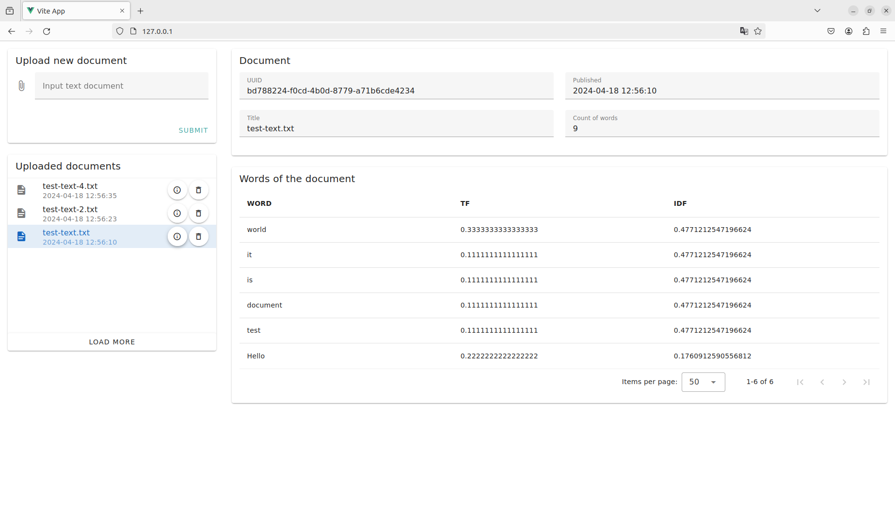

## Preview

This is the application looks like in the browser after uploading three .txt documents with latin words.

<picture>
  
</picture>


## Installation

1) Clone this repository:

```bash
git clone https://github.com/PavelKrivorotov/task_08_04_2024.git
```

## Usage

1) Run containers in work directory:
  
  ```bash
  docker compose up
  ```

2) Open this url adress in browser (Frontend):

 ```bash
 http://127.0.0.1:80
 ```

If you want to show API - open this adress (Backend)

```bash
http://127.0.0.1:8000
```
